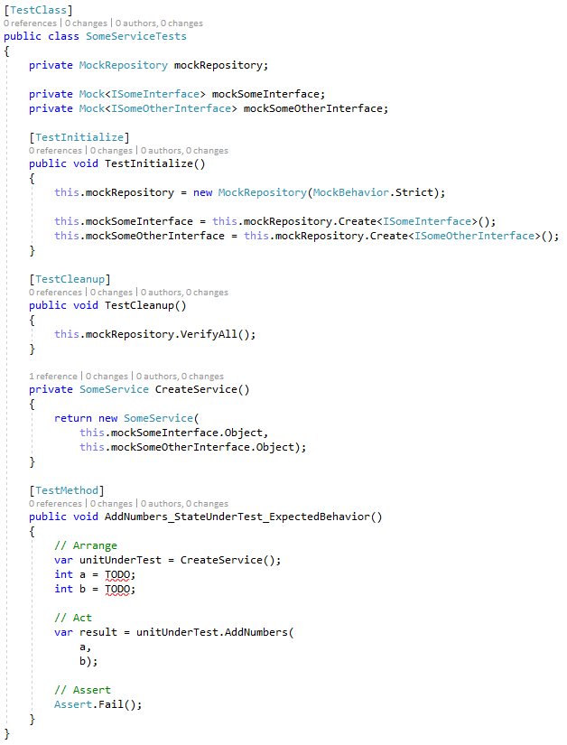

# Unit Test Boilerplate Generator

Download this extension from the [VS Gallery](https://visualstudiogallery.msdn.microsoft.com/f3f3b2a7-cefe-4ffe-add1-9740ae117252)
or get the [CI build](http://vsixgallery.com/extension/UnitTestBoilerplate.RandomEngy.ca0bb824-eb5a-41a8-ab39-3b81f03ba3fe/).

---------------------------------------

Generates a unit test boilerplate from a given class, setting up mocks for all dependencies. Supports Moq with constructor injection or dependency injection via Unity.

Right click an item in Solution Explorer and choose "Create Unit Test Boilerplate" .

This will create a test class in the same relative path as the class in a specified unit test project.
All the dependencies are mocked and saved as fields which are created fresh for each test via [TestInitialize].
It also adds a helper method which will construct the class for you and pass in all of the mock dependencies.
You can then call .Setup() and .Verify() on the mocks in your test methods.

The mock repository is set up as Strict by default, which means that it expects every call to a mock object
to have a .Setup() call for it. The VerifyAll() call at the end ensures that all of the setups in any mock
object have been invoked at least once.

See the [changelog](CHANGELOG.md) for changes and roadmap.

## Contribute
Check out the [contribution guidelines](CONTRIBUTING.md)
if you want to contribute to this project.

For cloning and building this project yourself, make sure
to install the
[Extensibility Tools 2015](https://visualstudiogallery.msdn.microsoft.com/ab39a092-1343-46e2-b0f1-6a3f91155aa6)
extension for Visual Studio which enables some features
used by this project.

## License
[MIT](LICENSE)